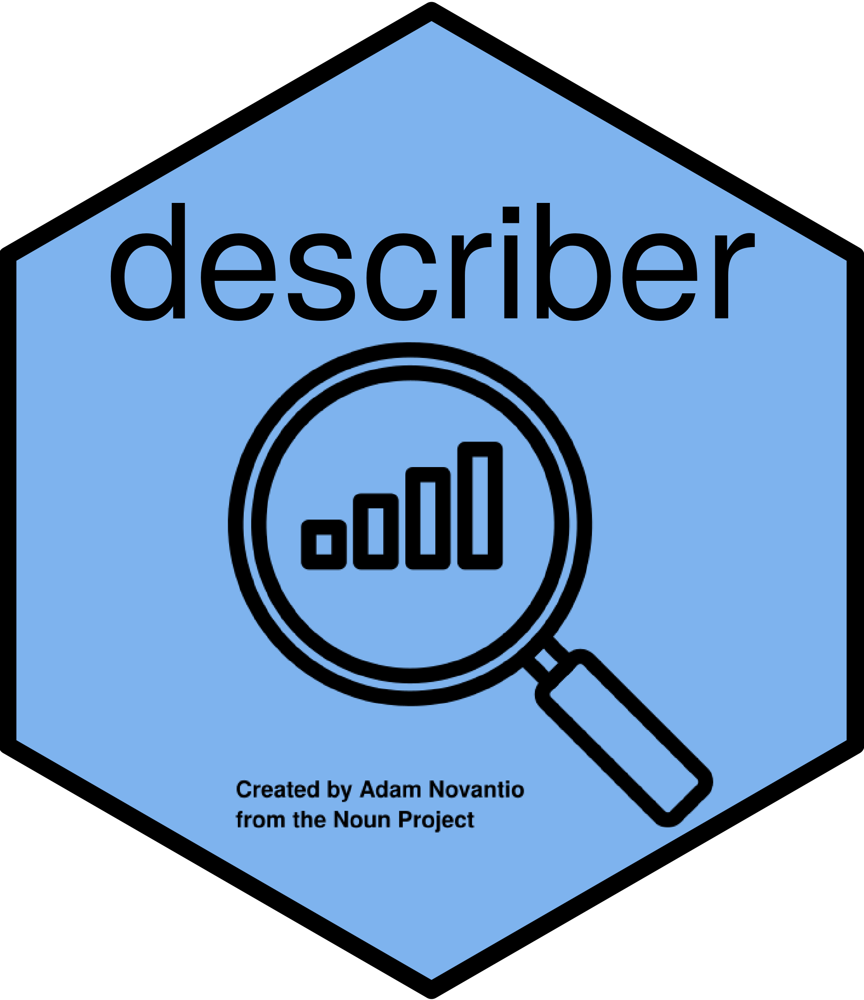

---
params:
    study:  'CDISCPILOT01'
    file:   'adsl.xpt'
    child:  no
title:      'Study: `r params$study`  &nbsp; &nbsp; Data: `r params$file`' 
date:       "<i class='fas fa-file-contract'></i> Created: `r format(Sys.time(),format='%A %d %b %Y  %I:%M %p %Z')`"
output: 
   flexdashboard::flex_dashboard:
     css: 'inst/style/styles.css'
     self_contained: true
     mathjax: NULL
     source_code: "https://github.com/agstn/describer" 
---

```{r knitr-defaults}
knitr::opts_chunk$set(warning = FALSE, message = FALSE, comment = NA)
knitr::opts_chunk$set(cache = FALSE)
options(width=170)
```

```{r load-packages}
library(describer)
library(tidyverse)
library(haven)
library(crosstalk)
```

```{r sample-vars, include=FALSE}
adsl <-read_xpt(str_glue("https://raw.githubusercontent.com/phuse-org/phuse-scripts/master/data/adam/cdiscpilot01/{params$file}")) %>%
  select(SUBJID, SITEID, ARM, AGE, SEX, RACE, ETHNIC,
         TRT01A, SAFFL, VISIT1DT, TRTSDT, TRTEDT,
         MMSETOT, BMIBL, HEIGHTBL, WEIGHTBL , DSRAEFL, DTHFL)
dim  <- dim(adsl)
adsl_nest_describe <- describe_data(adsl)
```

# DESCRIBER {#main}

Inputs {.sidebar data-width=300}
-------------------------------------
<br> <center> {width=150px} </center> <br>

```{r}
d_reactable <- adsl_nest_describe   

d_reactable_shared <- SharedData$new(d_reactable)

filter_select('type', 'variable TYPE',    d_reactable_shared, ~ TYPE)
filter_select('var',  'variable NAME',    d_reactable_shared, ~ VAR)
filter_select('lab',  'variable LABEL',   d_reactable_shared, ~ LABEL)
filter_select('n',    'variable COMPLETE',d_reactable_shared, ~ ifelse(n == dim[1], 'YES', 'NO'))

filter_slider('missing', 'variable % MISSING', d_reactable_shared,  ~ 100*(missing/dim[1]),
              width = 250,
              post = '%',
              min = 0, max = 100,
              dragRange = FALSE,
              step = 5, round = TRUE, sep = '', ticks = TRUE)

filter_slider('distinct', 'variable # DISTINCT', d_reactable_shared, ~ distinct,
              width = 250,
              min = 1, dragRange = FALSE,
              step = 5, ticks = FALSE)
```


Column
-------------------------------------
### <i class='fas fa-th'></i> **`r toupper(params$file)`** DATA with **`r dim[1]`** OBSERVATIONS and **`r dim[2]`** VARIABLES  

```{r create-reactable-1}
describer(data = d_reactable, data_shared = d_reactable_shared)
```

# DESCRIBE~static~ {#static}

Column {data-width=750}
-------------------------------------
```{r, out.height = "95%", out.width = "95%", fig.align = "left"}
knitr::include_app("rmd/adsl_describe.html", height = "875px")
```

Column {data-width=200}
-------------------------------------

### About Hmisc::describe

Every time a dataset is created, either for data management purposes or for statistical analyses, 
it is imperative that each variable be reviewed. Not only should the evaluation provide summary 
statistics and graphical displays to detect data errors, it should also present the results in a 
thorough, but succinct manner. To accomplish this goal, descriptive summaries for each variable 
should be created according to their characteristics.

The best available option for generating descriptive data set summaries is found in the [Hmisc: Harrell Miscellaneous](https://cran.r-project.org/web/packages/Hmisc/index.html) package for the 
R statistical programming environment. The [``describe``](https://rdrr.io/cran/Hmisc/man/describe.html) 
function determines whether the variable is character, factor, category, binary, discrete numeric, 
or continuous numeric and prints a concise statistical summary according to each.

Of note:

- For a binary variable, the sum (number of 1's) and mean (proportion of 1's) are printed

- For any variable with at least 20 unique values, the 5 lowest and highest values are printed

- A numeric variable is deemed discrete if it has <= 10 unique values. In this case, quantiles are not printed.

- A frequency table is printed for any non-binary variable if it has no more than 20 unique values


# DETAILS {#details}

Column
-------------------------------------
### <i class="fas fa-book"></i> **OVERVIEW** About the **describer** package // Go back to [main page](#main)

```{r child = 'rmd/overview.rmd'}
```

Column {.tabset}
-------------------------------------

### <i class="fas fa-wrench"></i> **INSTRUCTIONS** 

```{r child = 'rmd/instructions.rmd'}
```

### <i class='fas fa-chart-line'></i> **METRICS**

```{r}
get_metrics_info()
```
